# Cleaning Operations Portal

**Odoo 19** — Field Service visits executed by **portal cleaners**, with optional GPS and photo evidence, late check-in visibility, QR entry URLs, and a printable **Portal visit summary** PDF.

This repository ships two installable addons and a **step-by-step visual guide** (screenshots below) aligned with the demo presentation (`cleaning_operations_demo_presentation.pptx` / `.pdf` in the repo root).

---

## Contents

- [Features at a glance](#features-at-a-glance)
- [Modules](#modules)
- [Requirements](#requirements)
- [Installation](#installation)
- [Demo data & users](#demo-data--users)
- [Visual walkthrough (11 scenes)](#visual-walkthrough-11-scenes)
- [Reports](#reports)
- [Presentation assets](#presentation-assets)
- [License](#license)

---

## Features at a glance

- **Manager-side:** Assign a **portal cleaner** per Field Service task; see planned window, site, late check-in, timestamps, optional GPS, duration, and before/after photos.
- **Cleaner portal:** **My Visits** list and visit detail; **Start Visit** / **End Visit**; optional geolocation at start; before/after photo uploads.
- **QR entry:** Short URL pattern `/my/fsm-visit/<task_id>` (and full path after login) for QR codes.
- **Reporting:** **Portal visit summary** (QWeb PDF) on `project.task` for internal users — requires a working **wkhtmltopdf** on the Odoo server for PDF output.

---

## Modules

| Module | Purpose |
|--------|---------|
| **`cleaning_fsm_portal_executor`** | Extends `project.task` with portal executor fields, portal routes (`/my/fsm-visits`, …), security rules, and the visit summary report. |
| **`cleaning_operations_demo_data`** | Optional demo partners, portal/internal users, HR/planning scaffolding, and many **Field Service demo tasks** covering on-time, late, WIP, and edge scenarios. |

Add the **repository root** directory (the folder that contains both module folders) to Odoo **`addons_path`**. Odoo discovers one level of addons under each path entry — you do **not** need separate path entries per subfolder.

```text
.../cleaning_operations_portal
```

Install order:

1. `cleaning_fsm_portal_executor`
2. `cleaning_operations_demo_data` (optional, recommended for demos)

---

## Requirements

- **Odoo 19** Community + **Enterprise** addons (this workflow uses **`industry_fsm`**).
- Dependencies are declared in each module’s `__manifest__.py` (`project`, `portal`, `industry_fsm`, etc.).

---

## Installation

1. Clone or copy this repository onto the Odoo server.
2. Add the **repository root** to `addons_path` in your Odoo config.
3. Update the apps list, install **`cleaning_fsm_portal_executor`**, then optionally **`cleaning_operations_demo_data`**.
4. Set passwords for demo portal users (demo data does not store passwords).

---

## Demo data & users

The **`cleaning_operations_demo_data`** module creates, among other records:

- **Sites** (as `res.partner`): e.g. Harbor View Business Center, Al Noor Medical Plaza, Palm Heights Residential Tower.
- **Users:** one internal **operations manager** and three **portal cleaners** (Ahmed, Fatima, Omar — see demo data for logins).
- **Many FSM tasks** on the standard Enterprise **Field Service** project, including assigned/unassigned visits, completed visits, in-progress visits, late check-ins, and report-friendly examples.

**Security:** no plaintext passwords in module data. After install, set passwords under **Settings → Users** or use invitation / reset flows.

For a concise data inventory, see [`cleaning_operations_demo_data/README.md`](cleaning_operations_demo_data/README.md).

---

## Visual walkthrough (11 scenes)

Screenshots live in **`doc/guide/screenshots/`** (same content as the slide deck). Use this section as a **narrated demo script** for stakeholders or QA.

### Scene 1 — Manager-side operational evidence overview

**Single-task visibility** of QR entry, late check-in, timestamps, GPS, duration, and photo evidence.

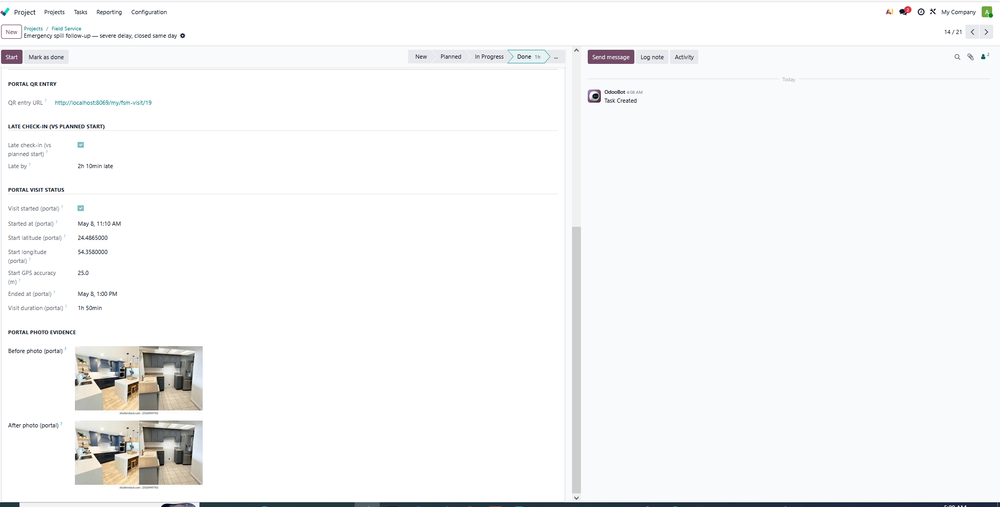

---

### Scene 2 — Assignment, site, and planned visit overview

The manager sees the **visit title**, **customer / site**, **planned window**, and **assigned portal cleaner**.

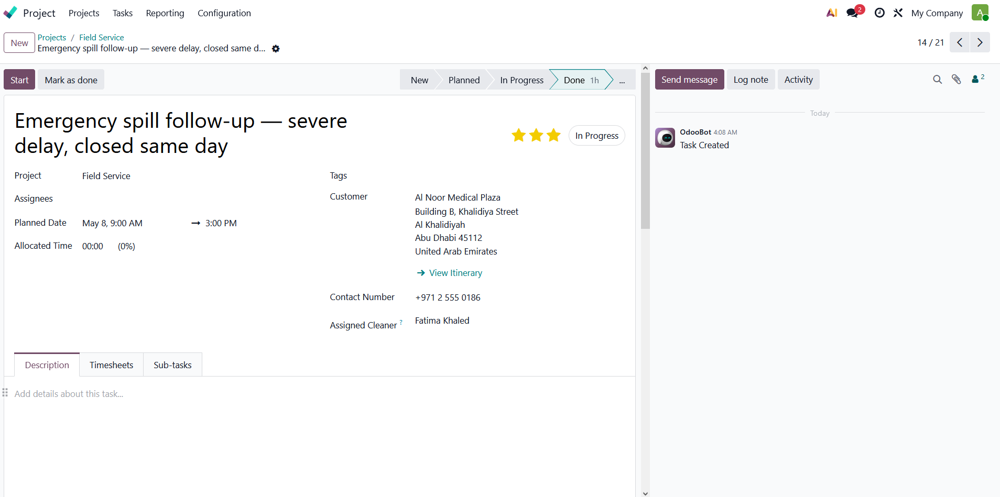

---

### Scene 3 — Cleaner portal homepage and entry point

The cleaner reaches the workflow from a simple **portal homepage** via **My Visits**.

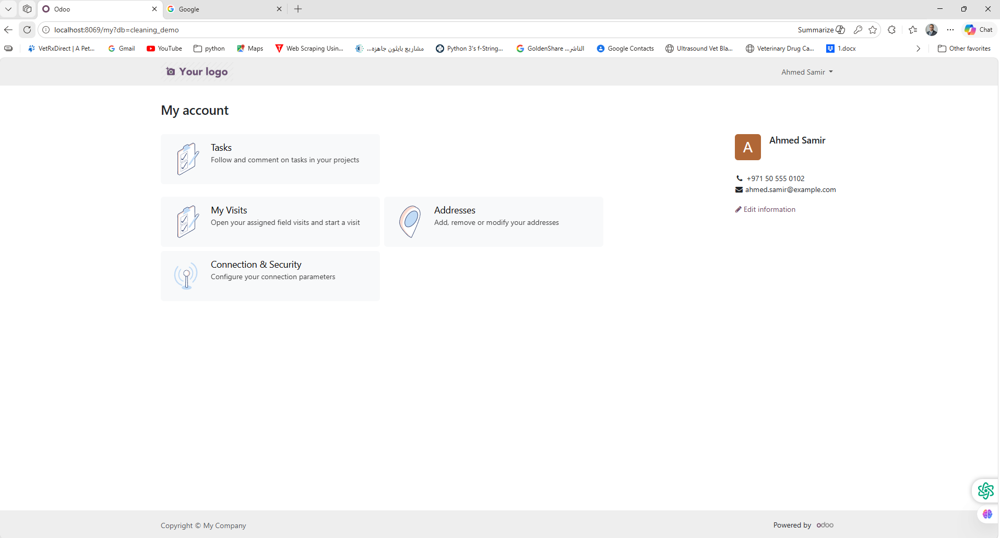

---

### Scene 4 — Cleaner work queue / My Visits list

The cleaner sees **only assigned visits**, with clear operational status.

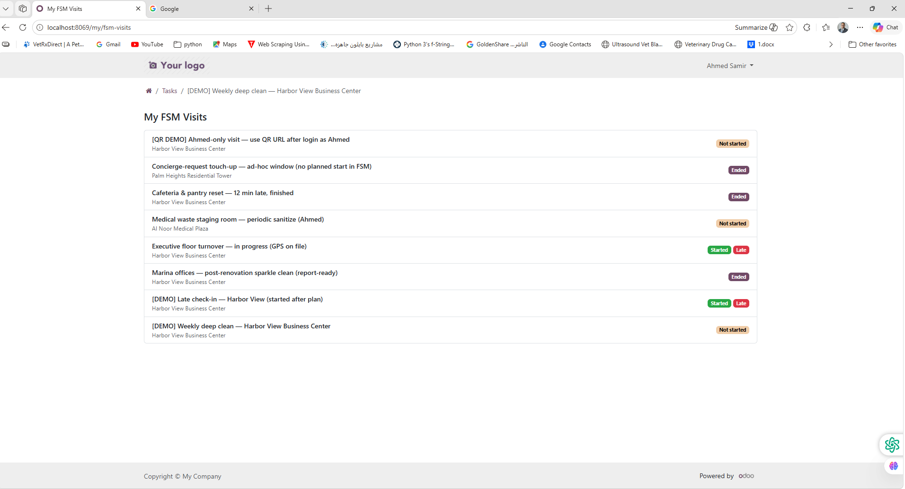

---

### Scene 5 — Visit detail before starting execution

Visit execution starts from a **portal page** with **Start Visit** and **photo evidence** sections.

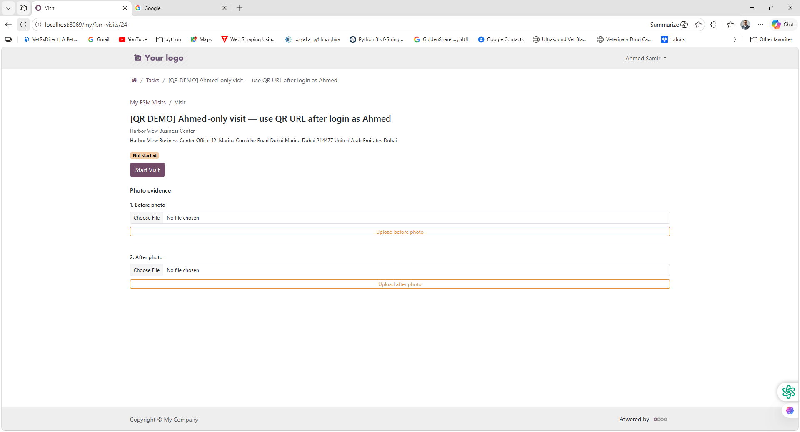

---

### Scene 6 — Visit started with graceful GPS fallback

**Check-in is recorded** even when GPS cannot be captured (optional evidence).

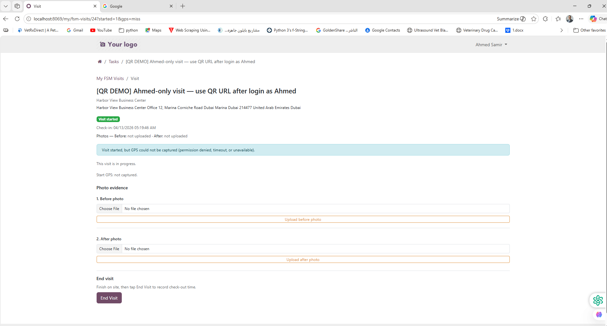

---

### Scene 7 — Before and after photo evidence captured

The cleaner uploads **visual evidence** directly from the portal.

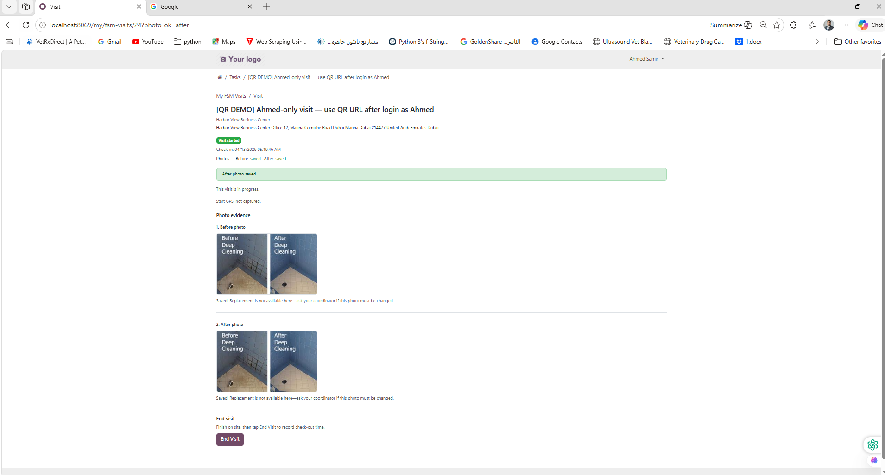

---

### Scene 8 — Visit completed with check-out and duration

The system records **check-out** and **visit duration** between portal start and end.

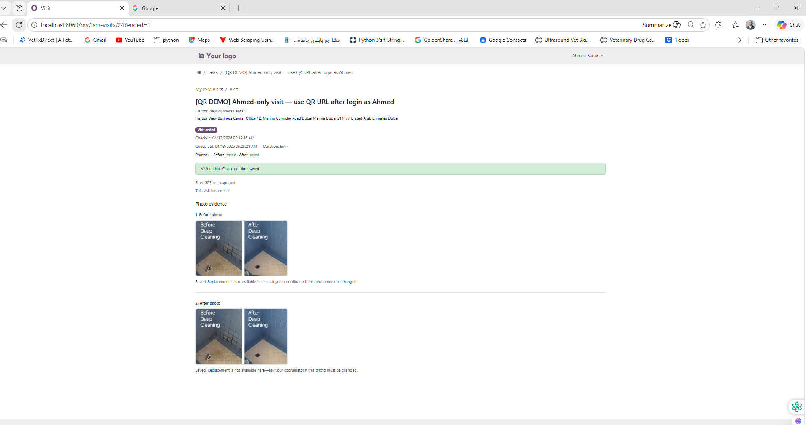

---

### Scene 9 — Late check-in visibility for the manager

The manager can **compare planned start** vs **actual check-in** and see late indicators where applicable.

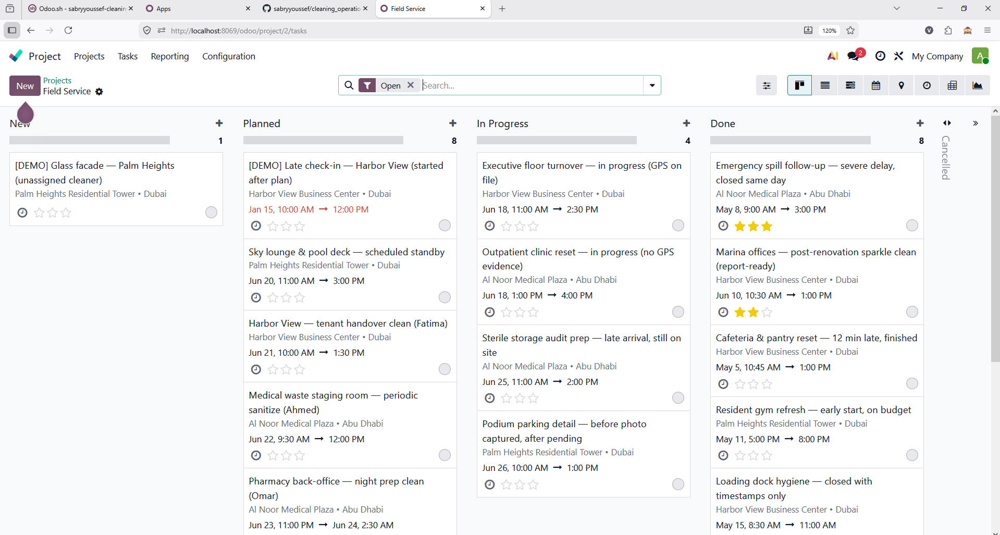

---

### Scene 10 — QR-based entry URL for the visit

Each visit exposes a **lightweight URL** suitable for encoding in a **QR code** (assigned cleaner opens the visit after login).

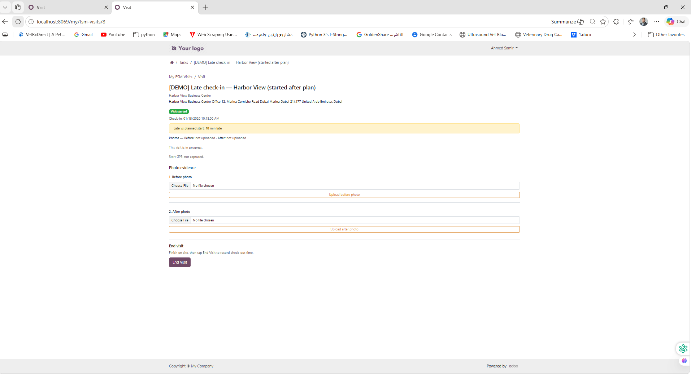

---

### Scene 11 — Printable portal visit summary report

Internal users can print a **single-visit summary** (PDF when **wkhtmltopdf** is available).

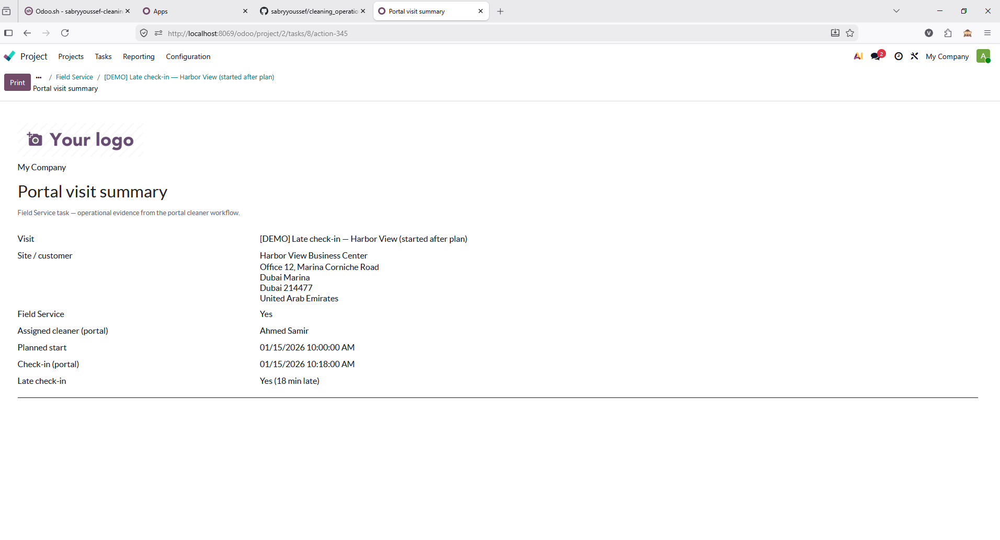

---

## Summary

- Manager-side visit assignment and oversight  
- Cleaner portal execution flow  
- Start and end timestamps  
- Optional GPS at check-in with graceful fallback  
- Before and after photo evidence  
- Late check-in visibility  
- QR-based visit entry  
- Printable visit summary report  

---

## Reports

- **Portal visit summary** is bound to **`project.task`** for users with project access (see module report definition).
- **PDF export** depends on **wkhtmltopdf** being installed and discoverable by the Odoo process (e.g. `bin_path` in `odoo.conf` on Windows). If PDF is unavailable, Odoo may fall back to HTML.

---

## Presentation assets

| Asset | Location |
|--------|----------|
| PowerPoint | `cleaning_operations_demo_presentation.pptx` |
| PDF | `cleaning_operations_demo_presentation.pdf` |
| Screenshot source (duplicate of `doc/guide/screenshots/`) | `scshots/` |
| Regeneration script | `build_demo_presentation.py` |

---

## License

Modules in this repository are **LGPL-3** unless stated otherwise in each `__manifest__.py`.

---

## Further reading

| Document | Description |
|----------|-------------|
| [`cleaning_fsm_portal_executor`](cleaning_fsm_portal_executor/) | Operational module (models, portal, report). |
| [`cleaning_operations_demo_data/README.md`](cleaning_operations_demo_data/README.md) | What demo data loads and design notes. |
